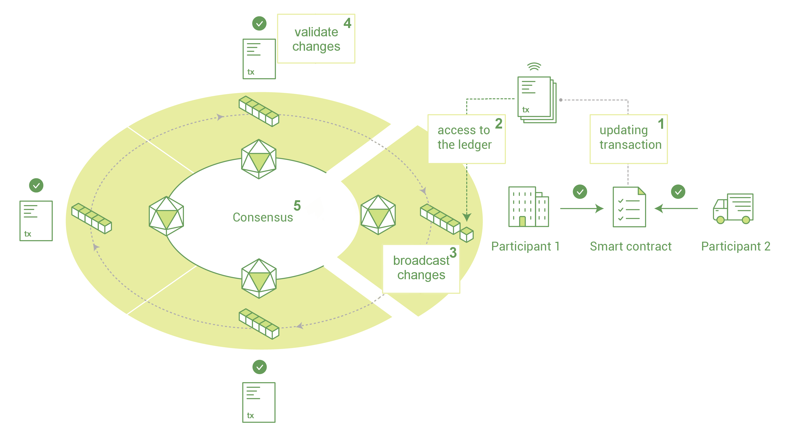
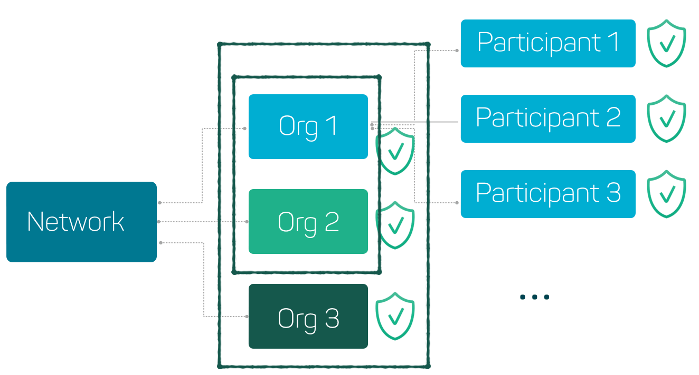
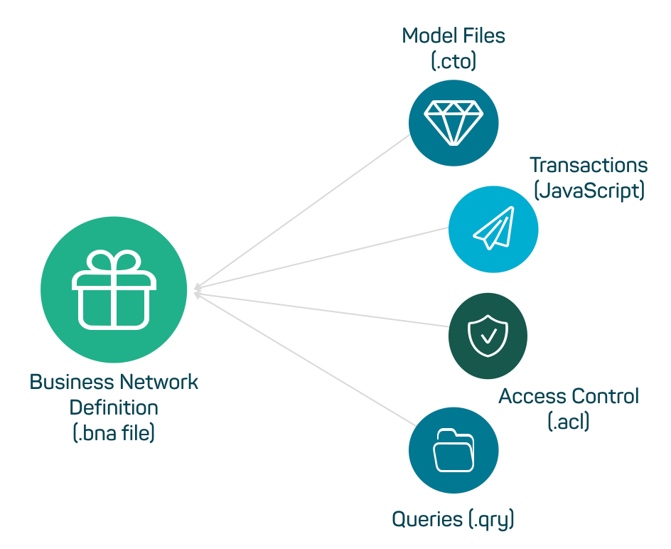
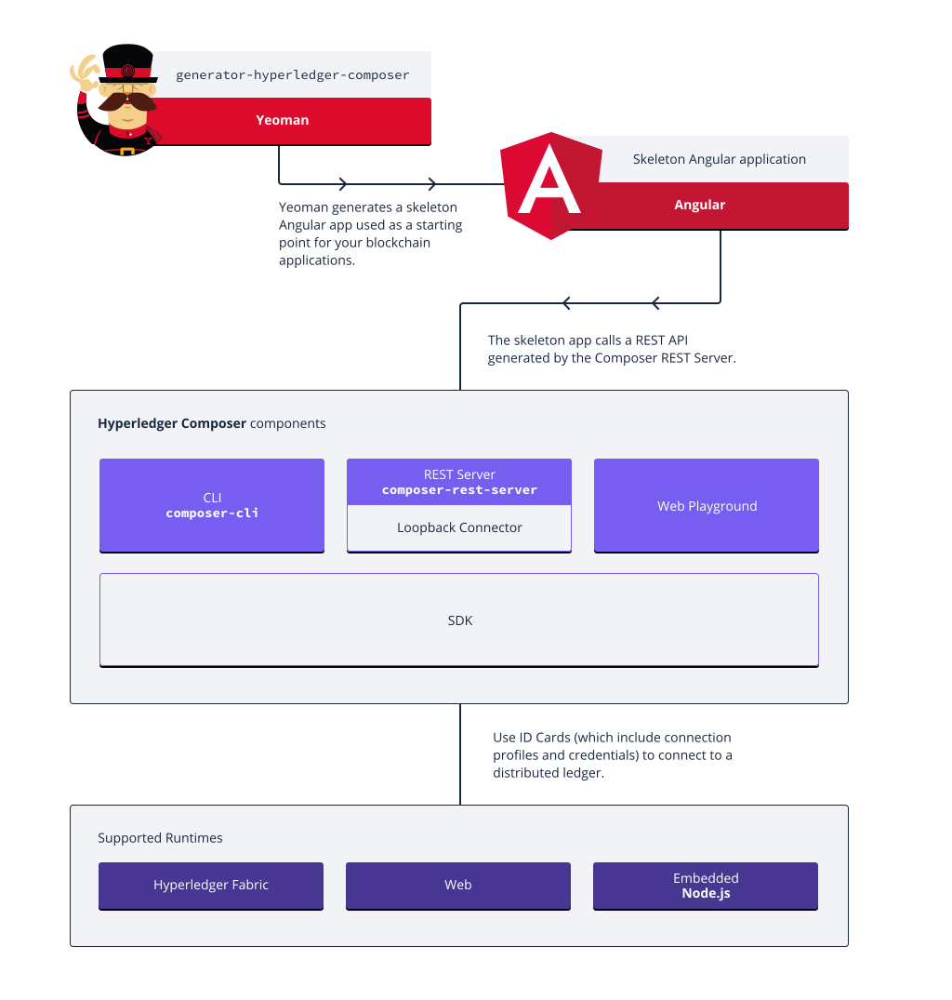
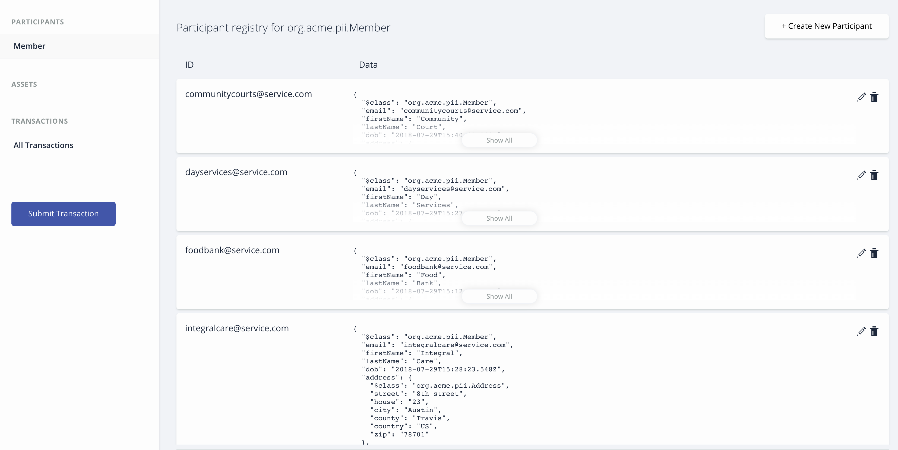

# City SafetyNet

Platform for conducting social services in a secure, private, &amp; confidential manner.

Tech Stack: 
- Hyperledger Fabric
- Angular 4
- NodeJs
- Rest API (Loopback) 

# Playground 

P.S: This project was build in THE MAYOR'S BLOCKCHAIN CHALLENGE conducted on July 27 - 29th at Faulk Library.
